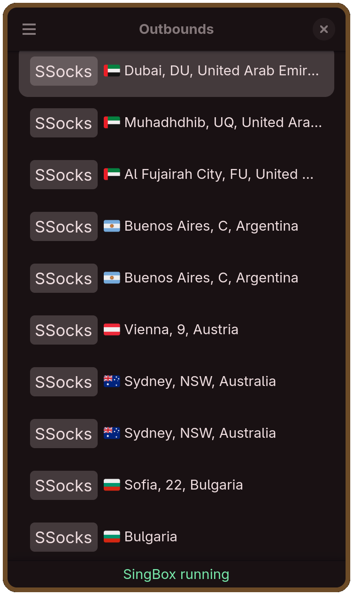
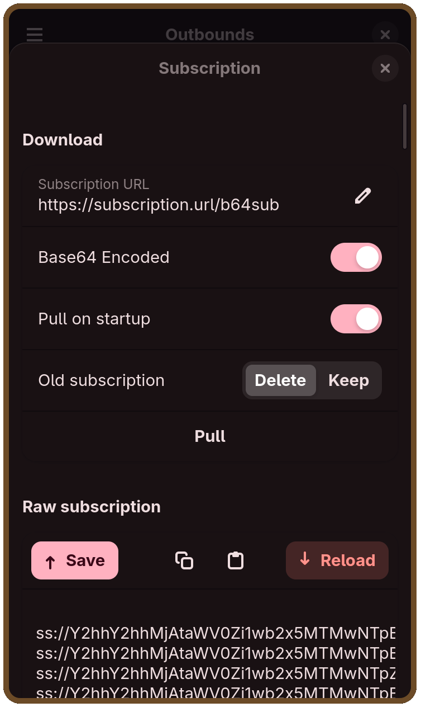

# SingNeko


SingBox wrapper.
## Screenshots
<table>
  <tr>
    <td align="center">
      
    </td>
    <td align="center">
      
    </td>
  </tr>
</table>

### Supported protocols:
* vless
* trojan
* shadowsocks
### Supported transports:
* grpc
* http
* http_upgrade
* quic
* ws

## ENV variables:
 - `SUB_FILE` = `.config/SingNeko/subscription` - path to subscription file

## Installation
You have a few options how to install:
### Alpine based: Use nightly/stable CI builds
1. Add my [stable](https://git.nekocwd.link/Administration/Documentation/src/branch/master/install-stable-repo.md)/[nightly](https://git.nekocwd.link/Administration/Documentation/src/branch/master/install-nightly-repo.md) repo
2. Install package
  ```
  sudo apk add singneko # singneko@nightly for nightly repo
  ```
### Build from source
#### Dependencies:
*	vala
*	blueprint-compiler
*	meson
* cmake
*	desktop-file-utils
*	json-glib
*	gettext
*	libadwaita
*	libgee
*	libsoup3
#### Configure build dir
```
meson setup build --prefix /usr
```
Tip: replace `/usr` with `~/.local` to install into homedir 
#### Build & Install
```
meson install -C build
```
